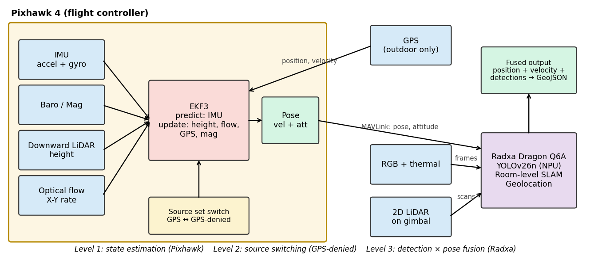
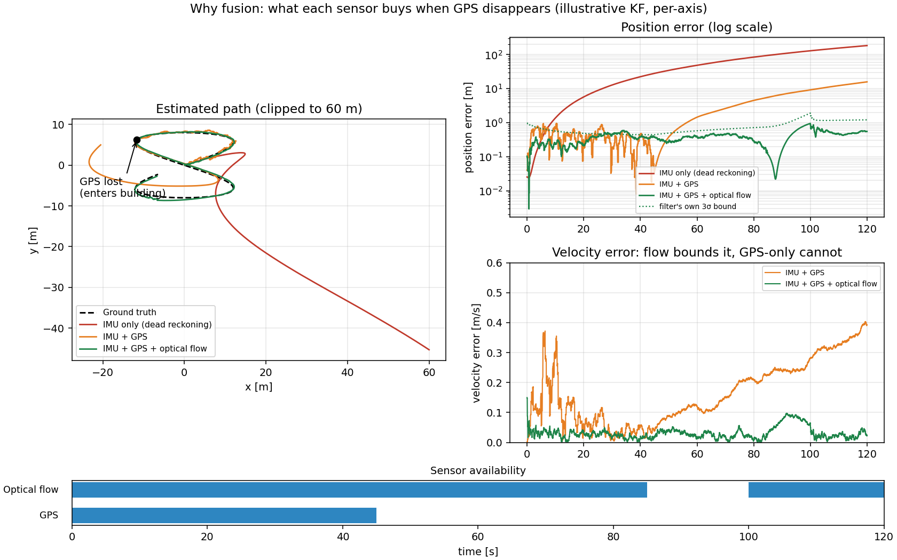
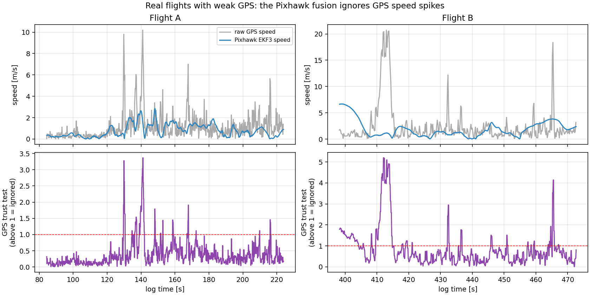
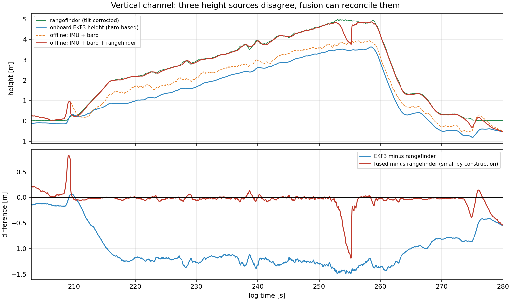
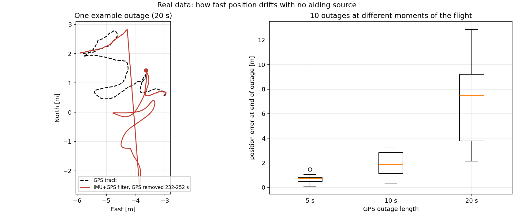
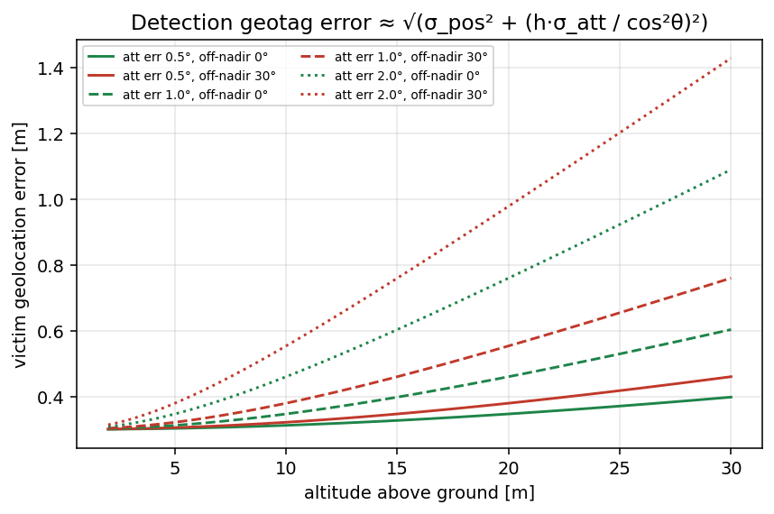

# Module 2: Multi-Sensor Fusion

**One line:** Shaurya combines several sensors so it always knows where it is and where a survivor was seen, even when GPS is weak or missing.

---

## 1. The problem

Inside a collapsed building there is no reliable GPS. No single sensor can tell the drone its position on its own, but each one is good at something:

| Sensor | What it tells the drone |
|---|---|
| IMU (accelerometer + gyro) | How the drone is moving and tilting, very fast |
| GPS | Position on the map, when the sky is visible |
| Optical flow | How fast the floor is sliding past, so speed without GPS |
| Rangefinder (downward LiDAR) | Height above the floor |

**Sensor fusion** means mixing these so each sensor covers the weakness of the others.

## 2. How it works: three layers

1. **Estimate (Pixhawk 4, EKF3).** The IMU predicts motion. GPS, height and speed sensors correct it. Output: position, speed and orientation.
2. **Switch sources.** When GPS is lost, the drone moves to the sensors that still work (optical flow for speed, rangefinder for height).
3. **Attach to detections (Radxa Dragon Q6A).** When the AI sees a person, the drone combines the detection with its own position and height to get the person's location for the GeoJSON alert.

## 3. Why fusion matters (simulation)

We simulated a two-minute flight where GPS is lost halfway. This is a simulation with assumed noise values, used to show the idea.

| Sensors used | Position error after 2 minutes |
|---|---|
| IMU only | 184 m |
| IMU + GPS (then GPS lost) | 16 m |
| IMU + GPS + optical flow | 0.55 m |

The more independent sensors we fuse, the less the position drifts.

## 4. Tested on real flight logs

We replayed recordings from real flights of our Pixhawk 4 drone and ran fusion experiments on them.

### 4.1 Fusion handles unreliable GPS

In these flights GPS was weak (as few as 4 satellites). Raw GPS speed jumps suddenly, while the Pixhawk fusion stays smooth. Its built-in "GPS trust test" shows when it decides not to follow a GPS reading (lower graph, above the red line).

The fusion only accepts a GPS reading when it agrees with what the motion sensors say.

### 4.2 Combining height sensors

The drone has two height sources: air pressure (barometer) and a downward rangefinder. In flight they differed by more than 1 m. Fusing them with the motion sensor gives one combined height that uses the rangefinder whenever it is valid.

### 4.3 Why we need more than the IMU

We removed GPS from a real flight and let the motion sensor alone estimate position. The longer GPS is missing, the faster the error grows. This is the reason Shaurya also uses optical flow and room-level SLAM when GPS is gone.

| GPS missing for | Typical position error |
|---|---|
| 5 s | 0.7 m |
| 10 s | 1.9 m |
| 20 s | 7.5 m |

*(Offline analysis of a recorded flight with slow logging, so read these as an order of magnitude.)*

## 5. From sensors to victim location

A detection is only pixels in an image. To tell rescuers where to go, we combine the detection with the drone's position, orientation and height at that exact moment.

Location error depends mostly on how well the drone knows its tilt and its height. In our model, at about 5 m height with 1 degree of tilt error, the location is within roughly 0.3 m.

## 6. Files

- `sensor_fusion_validation/fusion_sim.py`: simulation behind section 3
- `sensor_fusion_validation/ekf3_vs_gps_speed.py`: figure in section 4.1
- `sensor_fusion_validation/fusion_replay.py`: height fusion and GPS-outage analysis (sections 4.2 and 4.3)
- `assets/`: all figures

